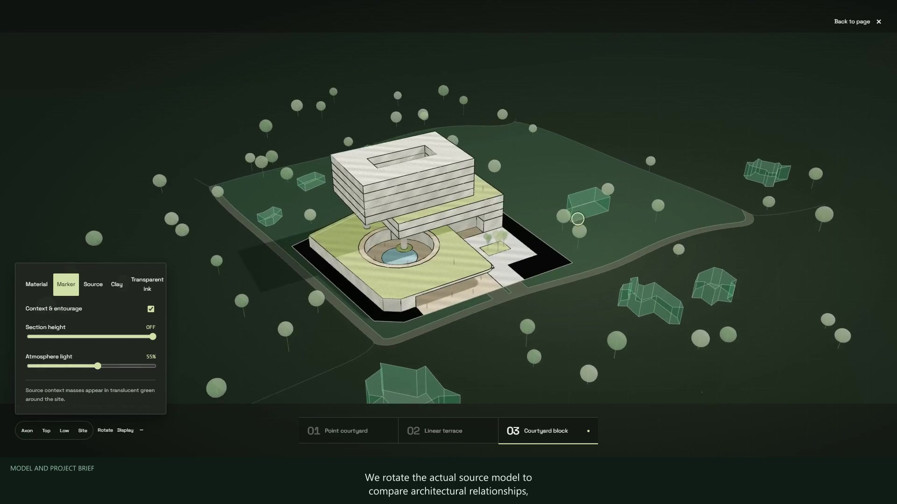

# 建筑资料 → 交互网页与汇报视频

**这是一份给 AI 看的制作说明书，以及配套的表格、风格和辅助脚本。** 把它和项目资料交给 ChatGPT、Codex 或其他能读文件的 AI，让 AI 按照说明整理内容、制作成果并检查。

它适用于建筑、室内、景观和城市设计。你不必懂代码，也不必先填完专业表格。**它不是双击就能自动生成网页或视频的独立软件**；能做到哪一步，取决于资料和当前 AI 可用的工具。

**HTML 就是一种用浏览器打开的网页文件。** 做好后，它像一个可以自己点击的小型项目展厅：看图片、放大图纸、阅读说明；有模型时，还能换个角度看。视频则适合直接播放给别人看。

## 能帮你做什么

- **交互方案册**：把图纸、图片和文字整理成网页，可按章节阅读、放大图纸、翻阅原册和比较方案。可制作在本地浏览器打开的离线版本。
- **模型展示**：有可读取的真实三维模型时，可旋转、缩放和切换方案；功能着色、剖切等操作还需要相应的模型信息。
- **清楚的图文汇报**：让图纸、说明和指标对应起来，保留来源。只有一个方案也能用，方案数和册页数按你的资料决定。
- **可选汇报视频**：用已有方案册制作讲解视频，录制真实操作，加入旁白、配乐和字幕，按需导出横屏、竖屏及五分钟以内版本。

六种表现方向可选：**深林编辑、白纸作品集、蓝图技术、砂岩展馆、瑞士网格、单色展廊**。可以选一种，也可以明确要求成品支持切换。

## 先准备这些就能开始

最少给 AI 两样东西：

1. **至少一份可读的项目资料**：PDF、图纸图片、方案册、任务书，或一段明确的项目介绍。
2. **一句展示目标**：例如“给业主看方案”“做作品集”“比较两个方案”。

想旋转模型，再提供原模型或可信的模型导出；想展示面积等指标，再提供相关表格及计算口径；已有 HTML 想做视频，直接提供最终 HTML 及所需本地文件。语言、风格和时长可以直接用文字说明。

缺资料也可以先做有依据的部分。图片不会被当成真实三维模型，缺失的指标不会被编造。需要补什么，AI 应先从附件提取，再问真正影响你所需功能的缺项。

## 普通 ChatGPT / GPT 对话怎么用

1. **[下载技能 ZIP](releases/architecture-interactive-html.zip?raw=1)，先解压。** 包内已有 `SKILL.md` 和 `references` 详细说明，可以直接开始。想把本首页、完整专业说明和示例文档也一起带走，可点击仓库绿色 **Code → Download ZIP** 下载整个仓库；大型示例视频仍从下方单独下载。
2. 在一个新对话里上传解压后的 [SKILL.md](architecture-interactive-html/SKILL.md)、[输入条件](architecture-interactive-html/references/input-requirements.md)、[制作要求](architecture-interactive-html/references/build-contract.md)、[风格说明](architecture-interactive-html/references/styles.md)、[验收要求](architecture-interactive-html/references/acceptance.md)，再附上自己的项目资料。
3. 复制下面的请求，改成自己的项目和目标，发送给 AI。

```text
请先阅读我上传的 SKILL.md 和相关说明，再根据项目附件制作成果。

项目：我的住宅方案
用途：给业主介绍设计思路
资料：见附件
成果：可在本地浏览器打开的交互 HTML 方案册
语言：中文
风格：深林编辑；如果更适合别的风格，请说明理由

先从附件提取信息，只问影响所需功能的真正缺项。
模型可读取时才启用真实旋转，不修改源模型，不编造指标。
请交付可打开的文件，并说明实际检查了什么、还有哪些限制。
```

**上传 ZIP 供 AI 读取，不等于把技能安装到了所有平台。** 如果不能上传文件，就粘贴 `SKILL.md` 和本次任务需要的相关说明，再粘贴项目文字；图片、模型仍须使用该平台支持的附件方式。没有生成文件的工具时，AI 可以先整理内容和制作方案，但不能声称已经交付可下载文件。

Codex 用户可以让它读取解压后的 `SKILL.md` 开始工作；安装后可用 `$architecture-interactive-html` 调用。[详细安装和使用方式](docs/professional-guide.md#codex)放在专业说明里。

## 想加一个汇报视频

继续提供最终 HTML，并补一句你需要的声音、时长和画面比例。比如：

```text
请用我提供的最终 HTML 制作五分钟以内的汇报视频。
中文女声，正常语速，舒缓的原创或已获许可配乐。
画面要对应讲解，模型操作按原速录制。
总时长不超过300秒；提供横屏16:9、竖屏9:16和独立字幕文件。
先实测配音时长，再安排镜头；工具不足时说明能完成的部分。
```

视频制作需要真实的语音、浏览器录制和视频输出工具；没有这些工具时，可先完成讲稿与分镜。模型旋转也需要可读取的模型。配乐、照片和声音应有使用依据；制作文件本身不包含代你上传社交平台。

## 下载一个已经完成的示例

下面是 **Woodlands 英文女声版，约4分55秒**，含原创配乐和画内英文字幕。它展示了真实模型操作、图纸讲解、方案比较和原册快速浏览；三方案与17页属于这个案例，新项目按自己的资料组织。

[](https://github.com/u20260608744-glitch/-HTML-/releases/download/v1.1.0/woodlands-landscape-1080p.mp4)

- [下载横屏 MP4：1920×1080](https://github.com/u20260608744-glitch/-HTML-/releases/download/v1.1.0/woodlands-landscape-1080p.mp4)
- [下载竖屏 MP4：1080×1920](https://github.com/u20260608744-glitch/-HTML-/releases/download/v1.1.0/woodlands-portrait-1080p.mp4)
- [下载完整包：横屏、竖屏、封面和说明](https://github.com/u20260608744-glitch/-HTML-/releases/download/v1.1.0/woodlands-social-downloads.zip)
- [查看示例讲稿、章节和验证说明](docs/woodlands-video.md) · [下载独立英文字幕](docs/video/woodlands-en.srt)

这些是已导出并检查的下载文件，未在小红书或微信执行上传。实际上传以当时的平台、账号和素材使用要求为准。示例视频放在 GitHub Release，技能 ZIP 里包含的是制作说明和配套文件。

## 选风格、查详细说明

解压后，双击 `architecture-interactive-html/assets/style-gallery.html`，在本地浏览器比较六种风格。GitHub 的 [HTML 文件页](architecture-interactive-html/assets/style-gallery.html)只显示源码。预览里的示意图用于选表现方向，不是已经完成的新项目。

| 想了解什么 | 看这里 |
|---|---|
| 详细能力、安装、资料类型和使用示例 | [专业使用说明](docs/professional-guide.md) |
| 给 AI 的完整入口 | [SKILL.md](architecture-interactive-html/SKILL.md) |
| 资料该怎么准备 | [简明资料表](architecture-interactive-html/references/user-intake.md) · [输入条件](architecture-interactive-html/references/input-requirements.md) |
| 六种风格如何选择 | [风格说明](architecture-interactive-html/references/styles.md) · [预览 HTML](architecture-interactive-html/assets/style-gallery.html) |
| 网页如何制作和检查 | [制作要求](architecture-interactive-html/references/build-contract.md) · [验收要求](architecture-interactive-html/references/acceptance.md) |
| 视频如何制作、配音和导出 | [视频制作流程](architecture-interactive-html/references/video-production.md) · [视频资料表](architecture-interactive-html/assets/video-intake.json) |
| 原案例依赖哪些资料 | [Woodlands 成果审计](architecture-interactive-html/references/woodlands-audit.md) |
