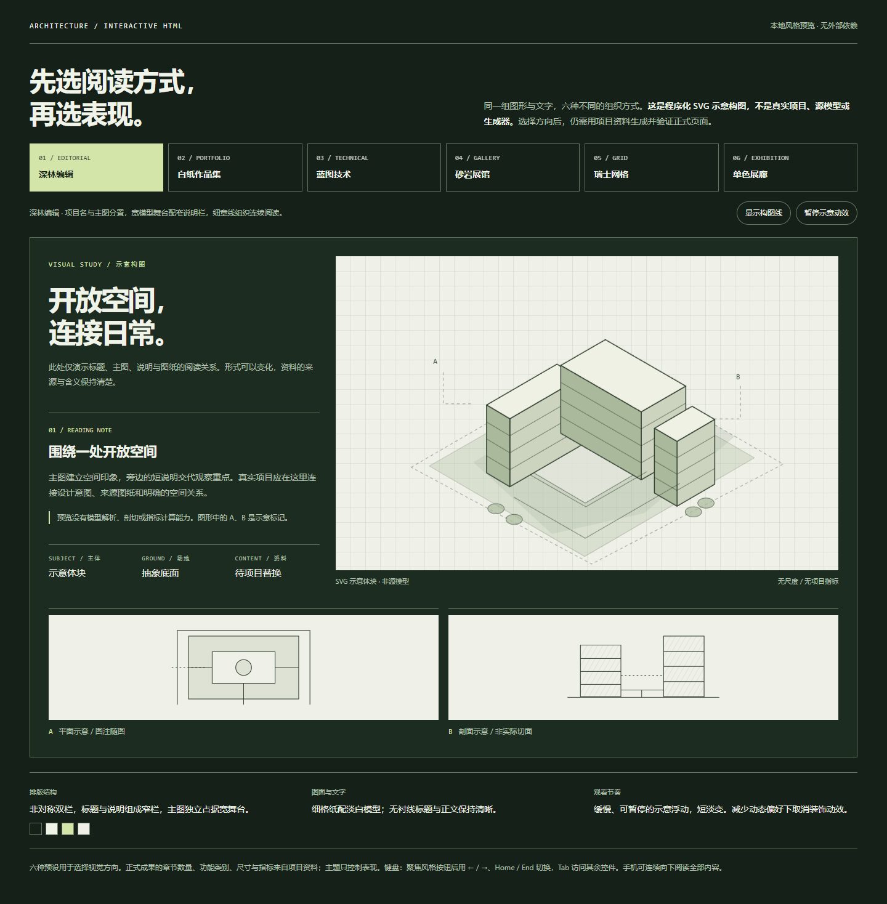
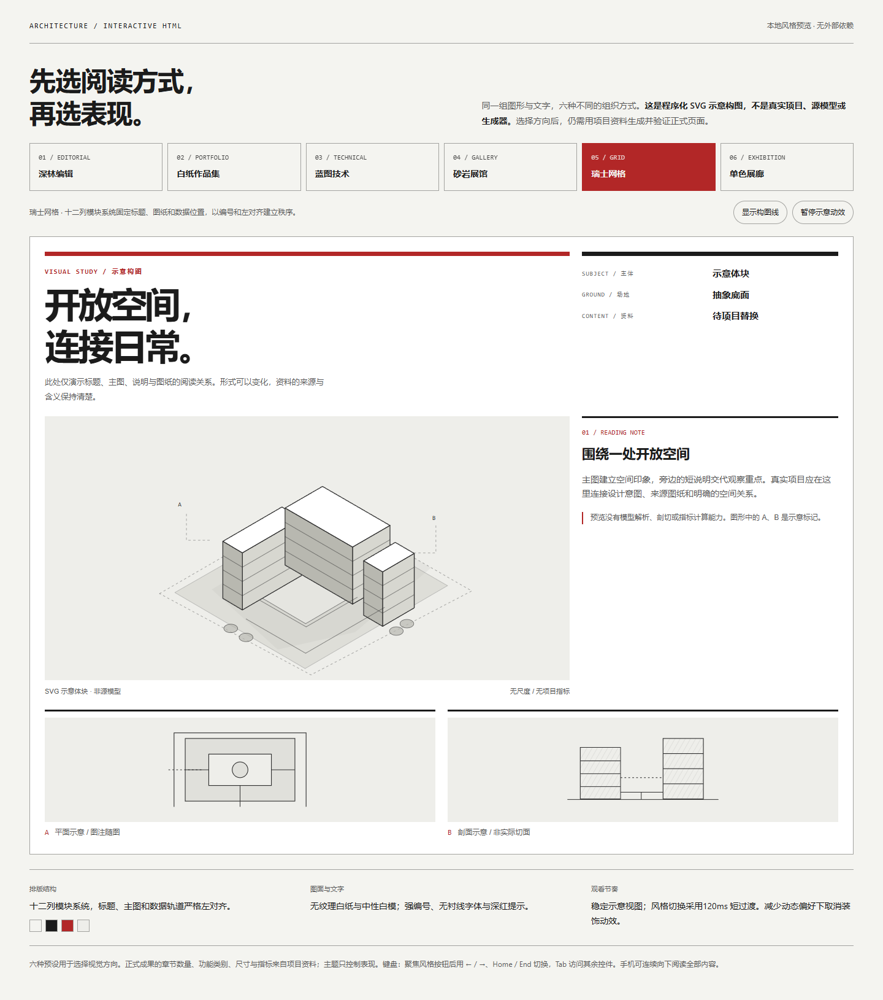

# 建筑交互 HTML 方案册与汇报视频技能

把项目模型、图纸、任务书和面积表，整理成可阅读、可比较、可操作的 HTML 方案册。先核查资料，再决定能实现哪些功能；资料不够时，仍可完成有依据的图文部分。

**v1.1：加入五分钟以内汇报视频流程。** 可继续使用已有 HTML，按其章节讲解并录制真实模型操作，制作旁白、配乐、同步字幕，以及横屏和竖屏下载版。视频仅在你提出要求时制作；声音、语言、时长和风格都可调整。

适用于住宅、办公、商业、公共建筑、园区、更新、室内、景观与城市设计项目。支持 **1 至 N 个方案**，原册页数按实际输入读取，章节随项目内容调整。

**这是供 GPT / Codex 使用的制作规范与资产包，不是一键模型解析器，也不是在线建模服务。** 能否读取原生模型、生成文件和运行测试，取决于当前 AI 环境可用的工具。制作网页不等于修改建筑设计。

## 先下载，再看风格

本仓库当前为私有仓库，需要使用有访问权限的 GitHub 账号查看、下载或安装。未登录或无权限时可能显示 404；这不表示仓库或文件丢失。

- [下载技能 ZIP](releases/architecture-interactive-html.zip?raw=1)
- [阅读技能入口](architecture-interactive-html/SKILL.md)
- [填写项目资料表](architecture-interactive-html/references/user-intake.md)
- [查看六种风格说明](architecture-interactive-html/references/styles.md)
- [风格预览 HTML 文件](architecture-interactive-html/assets/style-gallery.html)
- [视频制作流程及必需条件](architecture-interactive-html/references/video-production.md)
- [填写视频资料表 JSON](architecture-interactive-html/assets/video-intake.json)

## 看已完成的4分55秒示例

[](https://github.com/u20260608744-glitch/-HTML-/releases/download/v1.1.0/woodlands-landscape-1080p.mp4)

- [横屏 MP4：1920×1080，4分55秒](https://github.com/u20260608744-glitch/-HTML-/releases/download/v1.1.0/woodlands-landscape-1080p.mp4)
- [竖屏 MP4：1080×1920，4分55秒](https://github.com/u20260608744-glitch/-HTML-/releases/download/v1.1.0/woodlands-portrait-1080p.mp4)
- [完整发布下载包：横屏、竖屏、封面、说明](https://github.com/u20260608744-glitch/-HTML-/releases/download/v1.1.0/woodlands-social-downloads.zip)
- [示例讲稿、章节时间和来源版本说明](docs/woodlands-video.md)
- [独立英文字幕 SRT](docs/video/woodlands-en.srt)

示例沿 Woodlands HTML 的真实内容组织：模型旋转、四项场地分析、社区回应、三种形体、三方案总图与指标、剖面、功能联读、已建案例、方案比较、原册及总结。含英文女声、原创轻音乐、画内字幕。**三方案、17页、11段和75镜头属于这个案例**，新项目按实际资料组织。原册17页是快速浏览，不能当作每页已经详细讲解。

下载文件分别适配横屏阅读和竖屏手机构图，供微信、小红书等渠道选用。本次完成文件导出与本地验收，未在这些平台执行上传；实际上传须符合当时平台、账号及素材授权要求。视频记录了制作时的 HTML 快照，版本与当前 HTML 的差异见示例说明。

视频附件放在独立 GitHub Release，技能 ZIP 只包含制作规范、表格、风格资源和辅助脚本。仓库为私有，视频下载也需要访问权限。

下载并解压后，**双击 `architecture-interactive-html/assets/style-gallery.html`，在本地浏览器里切换六种风格**。它不依赖外网，可用鼠标或键盘操作；按钮聚焦后用方向键、Home / End 切换。

GitHub 的 HTML 文件页展示的是源码，**不是正在运行的交互预览**。两张截图仅供快速比较，完整预览请在本地打开。

### 深林编辑：非对称图文与模型舞台



### 瑞士网格：强编号与严格列系统



以上是同一组程序化 SVG 的**示意构图**，没有真实项目位置、尺度或指标。预览用于选择表现方向，没有模型解析、剖切或指标计算能力。

## 怎么用

### 普通 GPT 对话

1. 上传技能 ZIP；如果当前环境不能展开 ZIP，先解压，再上传下列核心文件。
2. 同时附上项目资料，可填写[资料表](architecture-interactive-html/references/user-intake.md)，也可直接说“见附件”。
3. 复制下面的调用文字，补上自己的项目和目标。

建议一起上传的核心文件：

- [SKILL.md](architecture-interactive-html/SKILL.md)
- [input-requirements.md](architecture-interactive-html/references/input-requirements.md)
- [build-contract.md](architecture-interactive-html/references/build-contract.md)
- [styles.md](architecture-interactive-html/references/styles.md)
- [acceptance.md](architecture-interactive-html/references/acceptance.md)

制作视频时，再附上 [video-production.md](architecture-interactive-html/references/video-production.md) 和 [video-intake.json](architecture-interactive-html/assets/video-intake.json)。已有 HTML 与项目文件一起提供；不需要重新填写附件中已有的章节和指标。

```text
请采用附件中的 architecture-interactive-html 技能，为我的项目制作 HTML 方案册。

项目：[名称、类型、地点；不确定的可写未知]
用途：[业主汇报 / 方案比较 / 作品集 / 其他]
资料：[见附件，或列出文件]
希望有的内容和交互：[场地、总图、模型、剖面、功能、比较、原册等]
语言：[中文 / 英文 / 双语]
风格：[指定一种，或请你推荐]
交付：[单文件离线 HTML / 本地文件夹]

先读取 SKILL.md，核查现有资料，输出“已具备 / 真正缺项 / 可先做”，
以及能力分级、章节计划和风格选择，然后完成已有资料支持的部分。
不要重新索取附件里已有的信息，不修改原模型、不编造建筑指标。
无法读取、执行或验证的部分要说明实际状态。
```

只有文本生成能力时，GPT 可以提供完整 HTML 代码，由你保存为 `.html` 后打开；这属于“代码已生成、尚未运行验证”。没有三维解析工具时，可先制作真实图纸交互版，再补充可读模型导出。

### Codex

技能以独立目录中的 `SKILL.md` 为入口，参考文件、资产和 Codex 元数据随目录一起提供。目录组织可参照 [OpenAI 技能文档](https://developers.openai.com/plugins/build/skills)。

如果你的 Codex 已有可用的 `skill-installer`，可以这样请求安装：

```text
$skill-installer
请从 https://github.com/u20260608744-glitch/-HTML-.git
安装仓库内 architecture-interactive-html 子目录的技能。
```

以安装器实际返回的结果为准。安装完成、技能已被当前环境识别后，在项目任务中调用：

```text
$architecture-interactive-html
请读取当前项目目录和附件，为[项目名称]制作[语言]离线 HTML 方案册。
采用[风格]，先核查资料和可用能力，再继续完成。
```

项目资料可以放在已有工作目录，不需要为了使用技能重命名全部文件。若没有安装器，也可让 Codex 读取本地解压目录的 `SKILL.md`，再按其指引读取参考文件。具体安装位置和可用解析器由你的环境决定。

## 最少需要提供什么

最小图文版需要：**至少一份可读取的图纸、图片或文字，以及可以确定的展示目标**。项目名称可先采用工作名；语言、风格和本地交付方式可使用明确说明后的默认值。

最方便的开头是：

```text
这是[项目名称或工作名]，属于[项目类型]，准备给[读者]看。
现有资料见附件。希望讲清[重点]，输出[语言]离线 HTML。
```

只有文字时可以建立文字型页面；没有建筑图片或模型，不能说已经生成了建筑图或真实模型。设计阶段、统计值等资料里没有的内容保持未知，不需要为了凑完整而填写数字。

### 项目文件分类

下表是资料清单，不是必须交齐的固定目录。已有资料能回答的信息由 AI 提取。

| 分类 | 可以提供的资料 | 用来实现什么 |
|---|---|---|
| 项目与任务 | 任务书、规划条件、项目说明、汇报笔记、变更补充 | 项目身份、目标、约束与设计回应 |
| 源模型 | 原生模型、可信 GLB/GLTF/OBJ 等导出、纹理和链接资源 | 真实模型浏览、源几何派生图 |
| 图纸 | 总图、平面、剖面、功能图；CAD、PDF、SVG 或图片 | 完整图纸阅读、图文联读；条件明确时派生空间交互 |
| 指标 | 面积表、Excel/CSV、计算书、图纸统计及版本说明 | 分项指标、同口径方案比较、可核推导 |
| 场地 | 红线、测绘、航片/卫星图、道路设施、周边高度、现场照片 | 场地和城市阅读；条件充分时量化分析 |
| 原册 | PDF、PPTX 或按顺序排列的完整页图 | 原页翻阅、目录、缩放及来源回看 |
| 品牌与风格 | Logo、品牌手册、有许可字体、参考网页或图片 | 配色、字体、图文结构与表现约束；可选 |
| 案例与出处 | 案例名称、借鉴问题、可使用的图片和署名 | 有来源的参考案例；可选，不影响其他模块 |

详细要求和缺项处理见[输入条件](architecture-interactive-html/references/input-requirements.md)。你不需要手填顶点、三角面索引或程序 ID；有解析工具时由 AI 提取，只有分组歧义才需要确认。

### 想要完整三维交互，还需要什么

- **可解析的真实模型或可信导出**。SKP、3DM、IFC、BLEND 等原生格式是否可读，取决于实际解析器；不支持时使用原软件导出的可读几何，并保留原模型核对。
- **方案和主体识别**：哪些模型组属于哪个方案，哪些是建筑主体、场地、周边、树或车辆。有明确层级时可自动提取。
- **尺度与轴向依据**：单位、原点、坐标轴和可核尺寸。缺单位仍可做无标尺浏览，但不能新生成真实面积、尺寸或比例尺。
- **空间语义**：功能类别与对象对应、楼层/标高资料；需要真切剖时提供切线、方向、保留侧或可信原生剖面场景。
- **专项资料**：指标来自面积表和明确口径；原册翻阅需要原册；地理分析需要相应坐标/底图依据。它们不会因为“有 3D”就自动成立。

若要准确匹配原册视角，提供保存的场景或相机依据。普通展示阴影是观看光照；真实太阳分析还需要可靠位置、真北、日期时间和相应计算工具。

## 六种风格能呈现什么效果

风格改变布局、字体组织、图面背景、材质表现和动效，**不是只换背景颜色**。同一项目的原图颜色与比例、源几何、功能含义和指标保持一致。

| 风格 / ID | 主要效果 | 适合的阅读任务 |
|---|---|---|
| 深林编辑 `forest-editorial` | 深森林底、大标题、非对称双栏、宽模型舞台和细格纸 | 概念汇报、住宅与景观、模型主导展示 |
| 白纸作品集 `paper-portfolio` | 暖白纸、宽松页边、主图配窄图注、局部图组 | 建筑作品集、院校与事务所展示 |
| 蓝图技术 `blueprint-technical` | 靛蓝主次网格、工程图矩阵、浅线框和稳定注释栏 | 技术评审、结构与空间组织分析 |
| 砂岩展馆 `sandstone-gallery` | 沙色纸面、居中大图、展签、暖白模型和克制阴影 | 文化建筑、酒店、商业与室内材料表达 |
| 瑞士网格 `swiss-grid` | 严格列系统、强编号、左对齐、固定数据位置和深红提示 | 竞赛、方案评比、办公与公共建筑 |
| 单色展廊 `monochrome-exhibition` | 黑白炭灰、全宽大图、少量强标题和连续图组 | 展览、业主讲解、视觉作品集 |

默认用**一种连贯风格**贯穿成品，同时提供风格方向供选择。明确要求“成品里可切换风格”时，才加入主题切换，并分别实现和验证所选风格。

“采用 A，可切换 B 与 C”表示 **A 是初始主题，A、B、C 都在切换集合中**；不是把三种风格混合成一套。需要混合设计时，请另行说明。

## 根据资料能实现哪些功能

以下是技能指导制作的能力，不表示下载 ZIP 后这些功能已经为你的项目生成。

| 功能 | 需要的依据 | 资料不足时的真实替代 |
|---|---|---|
| 章节导航、响应式图文 | 可读取图片、图纸或文字 | 按已有内容组织，不制造缺失图纸 |
| 图纸放大、平移、完整阅读 | 真实原图 | 保持比例和图字完整，不拉伸或重画来源内容 |
| 城市/场地/交通/配套/尺度阅读 | 对应底图、边界、标注或可信公共资料 | 做有来源的静态或定性说明，不冒充测绘 |
| 模型旋转、平移、缩放与方案切换 | 可解析几何及方案映射 | 用真实图片/图纸展示；不出现虚假旋转入口 |
| 视角、材质、线框与展示阴影 | 可用模型与所需材质/接收面 | 缺源相机用标明的新展示视角；缺条件可关闭阴影 |
| 功能颜色、热点与说明联读 | 明确分类、对象或图像区域映射 | 原图与文字并列；不按材质颜色猜功能 |
| 真实剖切、切面填色、楼层筛选 | 真实几何、切线/闭合证据及楼层语义 | 阅读原剖面；不把图片变形当切剖，不补造构件 |
| 总图与经济指标 | 同版图纸、指标来源、单位及统计口径 | 缺值显示待核或省略不适用项；图纸仍可阅读 |
| FAR、密度、面积余量与停车 | 完整计算输入、公式和口径；实际停车需布局/统计 | 有依据才计算；概算与实际数分开，未知不填 0 |
| 比例尺、真北与量化地理分析 | 相应尺度、坐标、方向和方法 | 保留原图已有说明，不新造真北或尺寸承诺 |
| 方案比较 | 多方案、同阶段同口径数据和清楚的比较目标 | 单方案不凑排名；缺共同口径不强行评分 |
| 原册翻页、目录、单/双页、缩放 | 真正提供的完整原册或有序图页 | 按实际页数阅读；部分资料称图纸画廊，不编造“完整册” |
| 双语或其他语言 | 可读取文本、指定语言及核对条件 | 保留原名和未知状态；按启用语言检查长文换行 |
| 离线与多风格 | 可本地打包的运行时和素材；明确选定风格 | 受体积/解析能力限制时说明本地多文件交付差异 |

这些能力独立判断。例如：有模型和面积表、没有功能映射，可以完成真实模型浏览和指标展示；功能高亮仍待补。缺模型但有完整原册，也可以交付有用的原册交互版。

## 四个可以直接复制的请求

### A. 只有图纸，先做完整阅读版

```text
请使用 architecture-interactive-html 技能。
这是一个室内更新项目，现有资料是附件中的 PDF、平面图和项目说明。
采用白纸作品集，输出中文单文件离线 HTML。
先核查资料，做图文同显、图纸放大和实际提供页数的原册阅读。
未提供源模型、尺度或面积口径，不生成真实3D、比例尺或FAR数字。
手机保留全部文字，以自然竖向阅读呈现。
```

### B. 有模型和面积表，做真实模型汇报

```text
$architecture-interactive-html
请读取当前目录里的任务书、原模型/可信导出、图纸和面积表。
这是给业主汇报的建筑方案，采用深林编辑，输出中文/英文离线 HTML。
先识别实际方案数量和建筑主体，再做真实模型浏览、总图指标和方案联动。
功能与剖面交互只在来源和对象映射明确时启用。
源几何、原册和报告指标保持不变，冲突与未知值就近说明。
交付可打开的成品及实际测试结果。
```

### C. 默认 A，完整切换 B 与 C

```text
$architecture-interactive-html
项目资料见附件。采用瑞士网格作为默认主题，
成品中可切换白纸作品集与蓝图技术，共三种完整风格。
瑞士网格也保留在切换集合中。
三种风格分别落实布局、字体、纸张与动效，不只换颜色。
切主题保持已选方案、相机、原册页码、功能颜色含义和指标不变。
按资料能力完成；分别验证三种风格的桌面和手机关键状态。
```

普通 GPT 未安装技能时，把 `$architecture-interactive-html` 换成“请采用附件中的 architecture-interactive-html 技能”，并上传核心文件即可。

### D. 用已有 HTML 制作五分钟汇报视频

```text
$architecture-interactive-html
请读取附件中的最终 HTML 和关联项目资料，制作300秒以内的汇报演示视频。
按 HTML 现有章节和内容展开说明，采用自然英文女声、轻柔器乐和英文字幕。
真实演示可用模型的旋转、方案切换和关键交互，保持模型操作与声音原速。
输出1920×1080横屏及1080×1920竖屏MP4、各自封面、SRT字幕、讲稿、
章节时间索引与下载ZIP，用于微信和小红书；先完成文件，暂不上传平台。
沿用 HTML 的视觉风格，竖屏重新构图，图纸和模型不变形。
先提取现有资料和章节，只询问真正缺项。若逐项详解无法在5分钟内完成，
先给出重点覆盖和时间分配，压缩重复讲解，不通过加速声音塞入。
```

视频需提供：**最终 HTML 或其可访问入口、要讲的重点/读者，以及已有约束**。章节、方案、页数和操作由 AI 提取；有自己的声音、音乐或 Logo 可一起提供，否则按可用工具选择有使用依据的素材。语音生成/录制、浏览器捕获和剪辑工具是制作能力条件，不能靠技能文本代替。没有执行工具的 GPT 可输出讲稿、分镜和配置，不能声称已生成可下载 MP4。

可覆盖默认值：中文/其他语言、不同声音、无配乐、字幕语言、不同时间上限、单一比例或多个比例。视频可以采用六种 HTML 风格，也可按你提供的品牌视觉设计。详细填写项见[用户填写表](architecture-interactive-html/references/user-intake.md)。

## 会交付什么

按实际可用能力，通常包括：

1. 可打开的 HTML，或明确启动入口的本地文件夹。
2. 输入清单、“已具备 / 缺项 / 降级”说明和来源/指标口径。
3. 选定风格、可用操作和实际验证结果。
4. 需要后续维护时，保留源代码、项目数据与构建/QA 记录。

请求视频时另交付成片、横竖屏封面、字幕、讲稿、时间索引和配乐出处，并记录最终媒体及录制源文件的 SHA256。视频放在独立文件夹/ZIP；只有你明确要求才嵌入原 HTML。

桌面优先图文对齐、关键内容在同一章节完整阅读；手机允许复合图文自然延长，不靠缩小到难读或隐藏正文实现“一屏”。按钮应有真实行为，重复主入口合并，方案及原页上下文入口仍保留。

原文件默认只读。派生图、转换模型和网页在工作副本中生成。指标区分原文、测量、推导、假设和未知；不因网页好看而改模型、换统计口径、补造停车数或分析结论。在线上传/公开发布与付费服务需另行授权。

## 当前实际验证范围

本技能包已做以下验证；它们用于说明当前包的质量，**不是任意新项目已经通过验收的证明**。

- **结构与数据**：26 项结构/JSON Schema 检查通过，包括未知值、来源、假设、公式和主题选择约束。
- **六风格预览**：本地 Edge 浏览器、关闭网络，在 1440×1000 与 390×844 下切换全部六种风格；检查布局差异、键盘、构图线、暂停和减少动态偏好。无脚本错误及外部运行请求。
- **独立前向试用**：使用专门原创的虚构诊所资料，实际读取文字任务、平面 SVG 和剖面 SVG；生成 1 方案、3 功能类别、2 张独立源图的中文离线页面，含瑞士网格/白纸作品集/蓝图技术三主题。Edge + Playwright 在 1920×1080、1280×720、390×844 下完成 305 项浏览器检查和 27 张截图；图纸阅读、缩放/平移、键盘/触摸、焦点回归与离线运行通过。
- **缺项处理**：该试用未提供模型、真实尺度、法定面积口径和停车布局，因此没有假旋转、假切剖、伪真北、FAR/密度或停车数字。
- **视频示例**：Woodlands 母版295.000秒，横竖发布版容器295.019秒，均低于300秒；25fps、7375帧。两版实际完成 H.264/AAC、yuv420p、SAR1:1、MP4前置索引和全音视频解码检查。完整记录见[示例验收摘要](docs/video/verification-summary.json)。实际平台上传不在本次验证范围内。
- **视频工具**：独立配置/schema 与按实测音频排时、最终媒体验收脚本随包提供；技术脚本不代替讲稿审查、真实动作确认、字幕可读性和听感检查。新项目应对自己的最终文件执行，不继承此案例的通过状态。
- **独立视频输入试用**：另用原创室内更新资料（1方案、2张SVG、无3D/尺度/指标），保留中文女声偏好、90秒上限和仅竖屏要求；用实际技术测试音完成85秒/2125帧排时，并验证超时、缺文件、错误源hash与加速配置的拒绝。这里验证的是输入与排时，不是已经录制了新的中文旁白或影片。

当前验证**不覆盖所有原生模型格式、任意规模模型、全部设备或任意建筑任务**。新项目需针对实际启用能力和最终文件重新核查；不能执行时应标注“未运行”，而不是声称通过。完整验收方法见[验收与交付](architecture-interactive-html/references/acceptance.md)。

## 包内文件怎么读

| 文件 | 谁需要读 | 用途 |
|---|---|---|
| [SKILL.md](architecture-interactive-html/SKILL.md) | AI 每次开始；用户快速了解 | 入口流程、能力分级及关键约束 |
| [输入条件](architecture-interactive-html/references/input-requirements.md) | 用户与 AI | 区分必需、可提取、可选资料与降级 |
| [用户填写表](architecture-interactive-html/references/user-intake.md) | 用户按需填写 | 首批资料与专项补充表、调用方式 |
| [实现契约](architecture-interactive-html/references/build-contract.md) | 实际生成页面的 AI/开发者 | 数据、状态、源模型、取景、比例与离线实现 |
| [风格规范](architecture-interactive-html/references/styles.md) | 用户选风格；AI 实现 | 六套风格及完整切换规则 |
| [验收规范](architecture-interactive-html/references/acceptance.md) | AI/开发者交付前 | 真正交互、视口、来源与离线检查 |
| [Woodlands 审计](architecture-interactive-html/references/woodlands-audit.md) | 需要追溯参照成果时 | 解释原案例的依据与迁移边界，不作为新项目数据 |
| [结构化资料表](architecture-interactive-html/assets/project-intake.json) / [Schema](architecture-interactive-html/assets/project-manifest.schema.json) | AI/开发者；用户可不手填 | 输入和项目 manifest 结构 |
| [主题预设](architecture-interactive-html/assets/theme-presets.json) | AI/开发者 | 配色、字体、布局、纸面与动效初始配置 |
| [离线风格预览](architecture-interactive-html/assets/style-gallery.html) | 用户本地打开 | 选择方向；使用示意图，不是项目生成器 |
| [Codex 元数据](architecture-interactive-html/agents/openai.yaml) | Codex 环境 | 技能显示与发现信息 |
| [视频流程](architecture-interactive-html/references/video-production.md) | 请求视频时的 AI/制作者 | 实测时间预算、真实录制、旁白配乐、字幕、横竖屏与验证 |
| [视频配置](architecture-interactive-html/assets/video-intake.json) / [Schema](architecture-interactive-html/assets/video-manifest.schema.json) | AI/开发者；用户可用文字填写 | 与 HTML manifest 分离的可选视频项目配置 |
| [视频辅助脚本](architecture-interactive-html/scripts/video_tools.py) | 有执行工具的 AI/开发者 | `plan` 实测音频排段；`verify` 检查最终 MP4、字幕及来源 hash |
| [实际示例说明](docs/woodlands-video.md) | 用户 | 查看成片效果、讲稿、时间索引和使用边界 |
